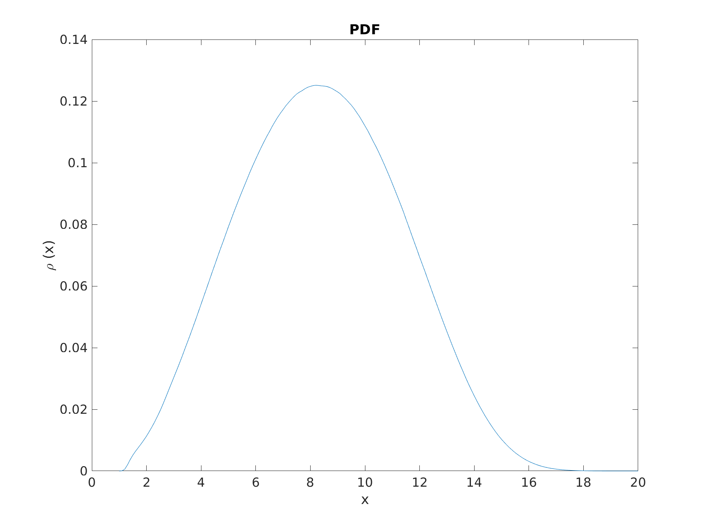
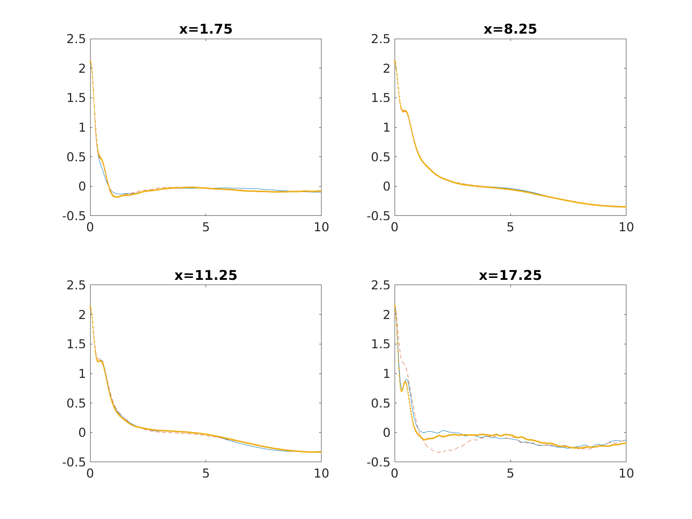

# Data-driven-learning-of-the-generalized-Langevin-equation-with-state-dependent-memory
## software

Matlab 2022a


## Case 2

A small case.

```math
\dot{v}_t=f(x_t)-h(x_t)\int_0^t \theta(t-\tau) h(x_\tau)v_\tau d\tau +h(x_t)R_t
```

```math
h(x)= \frac{\langle \dot{v}_0-f(x_0),\dot{v}_0 |x_0=x \rangle}{\langle v_0,v_0 \rangle}
```





### The MD data
The MD data is generated by in.box file in case2/MD_data/in.box with LAMMPS

## Case 1

Full original data can be accessed from  https://globus.msu.edu/file-manager?origin_id=63b1064b-1c02-4766-a22e-5b5e5880f275&origin_path=%2F
