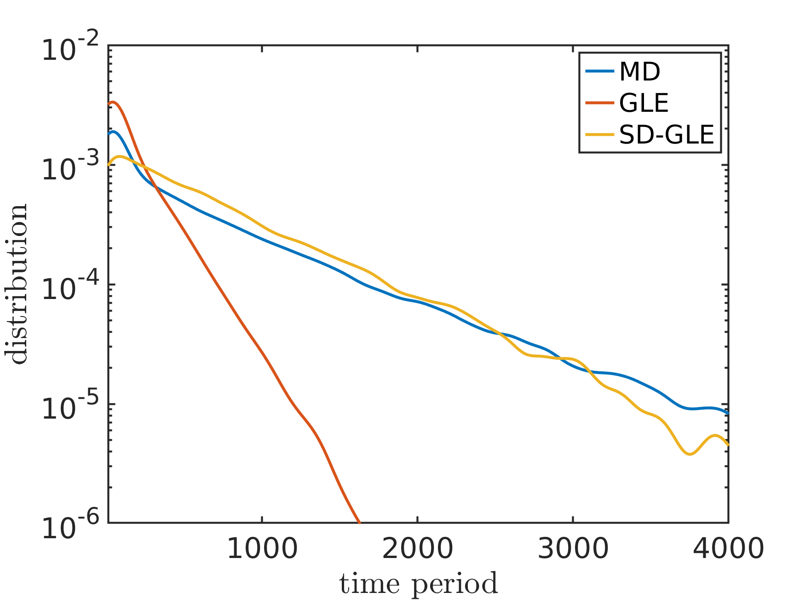

# Data-driven learning of the generalized Langevin equation with state-dependent memory
This project is for [arXiv:2310.18582](https://arxiv.org/abs/2310.18582). 

## Abstract
We present a data-driven method to learn stochastic reduced models of complex systems that retain a state-dependent memory beyond the standard generalized Langevin equation (GLE) with a homogeneous kernel. The constructed model naturally encodes the heterogeneous energy dissipation by jointly learning a set of state features and the non-Markovian coupling among the features. Numerical results demonstrate the limitation of the standard GLE and the essential role of the broadly overlooked state-dependency nature in predicting molecule kinetics related to conformation relaxation and transition.

## Numerical Example 1

### System

Consider a polymer molecule consisting of $N = 16$ atoms. The resolved variable is defined as the end-to-end distance. ([see details here](https://pubs.aip.org/aip/jcp/article/158/3/034102/2871114/Data-driven-construction-of-stochastic-reduced)).

### Codes

The example is given in folder 'case_unimodal', and 'main.m' provides how to drive these codes.

1. Run full molecular dynamics simulation which is given in 'MD_data/in.box' for LAMMPS setup and 'MD_data/data.box' for inital data.

2. Collect reduced variable by 'step0_collect_data.m' which will generate 'xv_*.mat' in 'MD_data'. Each '.mat' file contains the position and velocity of one trajctory.

3. Compute the probability distribution function by 'step1_PDF.m', which will also get the conservative force ('data/PDF.mat').

4. Compute the 1D $h(x)$ by 'step2_hx.m'. This is done by only consider the state-dependency when $t=0$ ('data/PDF.mat').

```math
m\dot{v}_t=F(x_t)-h(x_t) \int_0^t \theta(t-\tau)h(x_\tau) v_\tau d\tau+h(x_t) R_t 
```
```math
h(x)= \frac{\langle \dot{v}_0-f(x_0),\dot{v}_0 |x_0=x \rangle}{\langle v_0,v_0 \rangle}.
```

5. Compute the two points correlation functions by 'step3_corr.m' and 'step4_hx_corr.m' to construct 1D kernel ('data/corr.mat' and 'data/hx_corr.mat').

```math
\frac{m\dot{v}_t-F(x_t)}{h(x_t)}= \int_0^t \theta(t-\tau)h(x_\tau) v_\tau d\tau+ R_t 
```
```math
\langle \frac{m\dot{v}_t-F(x_t)}{h(x_t)},v_0 \rangle= \int_0^t \theta(t-\tau) \langle h(x_\tau) v_\tau, v_0 \rangle d\tau+ R_t 
```

6. Compute three point correlation functions for ND state-dependent kernel by 'step3_training_set.m' and 'step4_collect_training_set.m' ('data/dx_10_w_501.mat').

7. Train the model with 'train.py' and 'get_model.py' ('MD_ND_2.mat')

8. Simulate the standard GLE model and state-dependent GLE model by 'step5_std_GLE.m', 'step5_hx_GLE_1D.m' and 'step5_hx_GLE_2D.m' (mat files in 'GLE_data').

9. Compute correlation functions of all three models by 'step6_GLE_corr.m' ('corr_GLE.mat', 'corr_hx_GLE_1D.mat', 'corr_hx_GLE_2D.mat').

### Result


The following two figures shows $\langle v(t),v(0) \rangle$ and $\langle v(t),v(0) |x(0)=x^* \rangle$

<p align="center">
  
  
</p>


The following figure shows the distribution of the continuous time period that $x>15$.


The MD data is generated by in.box file in case_unimodal/MD_data/in.box with LAMMPS

## Numerical Example 2 (case_bimodal)
### System

Consider the molecule benzyl bromide in an aqueous environment. The full system consists of one benzyl bromide molecule and 2400 water molecules with the periodic boundary condition imposed along each direction. The resolved variable is defined as the distance between the bromine atom and the ipso-carbon atom. ([see details here](https://arxiv.org/abs/2310.18582))

### Codes


A state-dependent case with bimodal distribution, the probability distribution function is shown as:


The following two figures shows $\langle v(t),v(0) \rangle$ and $\langle v(t),v(0) |x(0)=x^* \rangle$


The following figure shows the distribution of the transition time between the two local minima.


## data
Full data including MD data, training set and simulation data of unimodal case can be accessed from Globus with the link (https://app.globus.org/file-manager?origin_id=ec51ed95-bc26-44a4-a8a0-65b74d694c33&origin_path=%2F).


## software

Python enviroments is given in file 'conda-environment.txt'. 

Matlab version is 2022a. 

LAMMPS version is (4 Jul 2012)