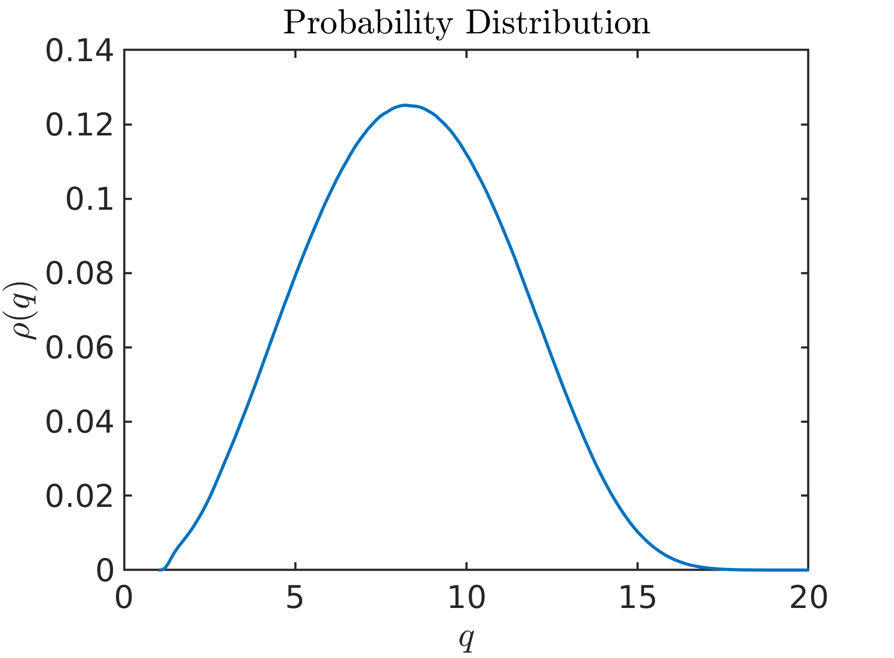
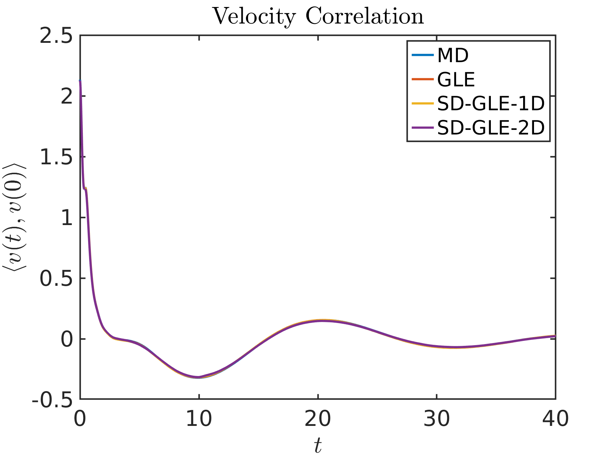
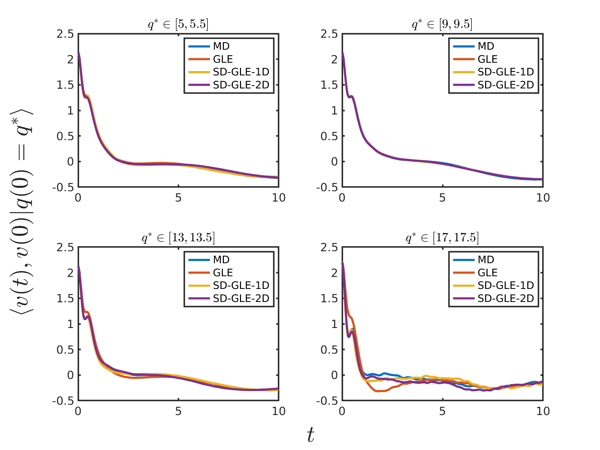
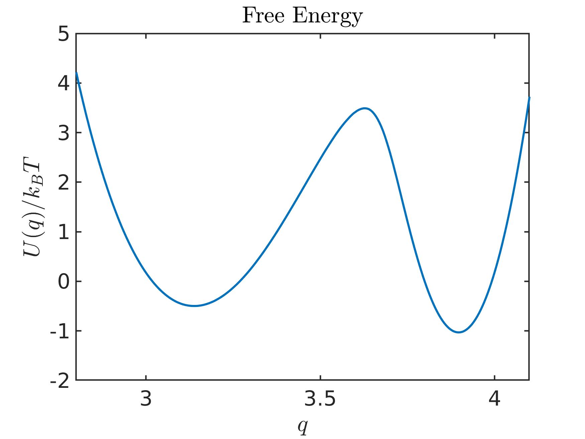
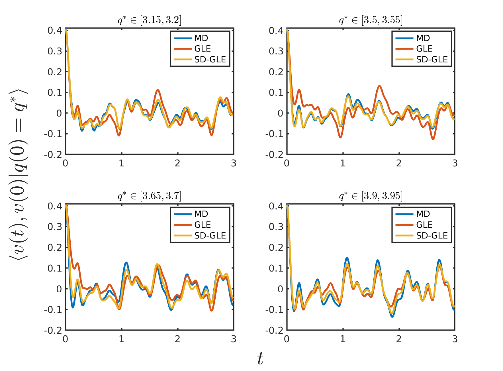

# Data-driven learning of the generalized Langevin equation with state-dependent memory
This project is for [arXiv:2310.18582](https://arxiv.org/abs/2310.18582). 

## Abstract
We present a data-driven method to learn stochastic reduced models of complex systems that retain a state-dependent memory beyond the standard generalized Langevin equation (GLE) with a homogeneous kernel. The constructed model naturally encodes the heterogeneous energy dissipation by jointly learning a set of state features and the non-Markovian coupling among the features. Numerical results demonstrate the limitation of the standard GLE and the essential role of the broadly overlooked state-dependency nature in predicting molecule kinetics related to conformation relaxation and transition.

## Numerical Example 1

### System

Consider a polymer molecule consisting of $N = 16$ atoms. The resolved variable is defined as the end-to-end distance. ([see details here](https://pubs.aip.org/aip/jcp/article/158/3/034102/2871114/Data-driven-construction-of-stochastic-reduced)).

### Codes

The example is given in folder 'case_unimodal', and 'main.m' provides how to drive these codes.

1. Run full molecular dynamics simulation which is given in 'MD_data/in.box' for LAMMPS setup and 'MD_data/data.box' for inital data.

2. Collect reduced variable by 'step0_collect_data.m' which will generate 'xv_*.mat' in 'MD_data'. Each '.mat' file contains the position and velocity of one trajctory.

3. Compute the probability distribution function by 'step1_PDF.m', which will also get the conservative force ('data/PDF.mat').

4. Compute the 1D $h(q)$ by 'step2_hx.m'. This is done by only consider the state-dependency when $t=0$ ('data/PDF.mat').

```math
m\dot{v}_t=F(q_t)-h(q_t) \int_0^t \theta(t-\tau)h(q_\tau) v_\tau d\tau+h(q_t) R_t 
```
```math
h(q)= \frac{\langle \dot{v}_0-f(q_0),\dot{v}_0 |q_0=q \rangle}{\langle v_0,v_0 \rangle}.
```

5. Compute the two points correlation functions by 'step3_corr.m' and 'step4_hx_corr.m' to construct 1D kernel ('data/corr.mat' and 'data/hx_corr.mat').

```math
\frac{m\dot{v}_t-F(q_t)}{h(q_t)}= \int_0^t \theta(t-\tau)h(q_\tau) v_\tau d\tau+ R_t 
```
```math
\langle \frac{m\dot{v}_t-F(q_t)}{h(q_t)},v_0 \rangle= \int_0^t \theta(t-\tau) \langle h(q_\tau) v_\tau, v_0 \rangle d\tau+ R_t 
```

6. Compute three point correlation functions for ND state-dependent kernel by 'step3_training_set.m' and 'step4_collect_training_set.m' ('data/dx_10_w_501.mat').

7. Train the model with 'train.py' and 'get_model.py' ('MD_ND_2.mat')

8. Simulate the standard GLE model and state-dependent GLE model by 'step5_std_GLE.m', 'step5_hx_GLE_1D.m' and 'step5_hx_GLE_2D.m' (mat files in 'GLE_data').

9. Compute correlation functions of all the reduced models by 'step6_GLE_corr.m' ('corr_GLE.mat', 'corr_hx_GLE_1D.mat', 'corr_hx_GLE_2D.mat').

10. The visualization is at the end of the 'main.m'. 

### Result

<p align="center">

</p>

The following two figures shows $\langle v(t),v(0) \rangle$ and $\langle v(t),v(0) |q(0)=q^* \rangle$

<p align="center">
  
  
</p>


The following figure shows the distribution of the period for the molecule taking a certain conformation state ($q>15$).

<p align="center">

</p>

## Numerical Example 2 (case_bimodal)
### System

Consider the molecule benzyl bromide in an aqueous environment. The full system consists of one benzyl bromide molecule and 2400 water molecules with the periodic boundary condition imposed along each direction. The resolved variable is defined as the distance between the bromine atom and the ipso-carbon atom. ([see details here](https://arxiv.org/abs/2310.18582))

### Codes

The example is given in folder 'case_bimodal', and 'main.m' provides how to drive these codes.

1. Compute the probability distribution function by 'step1_PDF.m', which will also get the conservative force ('data/PDF.mat').

2. Compute the two points correlation functions by 'step2_std_corr.m' to construct 1D kernel ('data/corr.mat').

3. Compute three point correlation functions for ND state-dependent kernel by 'step3_training_set.m' and 'step4_collect_training_set.m' ('data/dx_0.2_w_301.mat').

4. Train the model with 'train.py' and 'get_model.py' ('MD_ND_4.mat', 'MD_ND_4_std.mat' is the model used in article, 'MD_ND_4_lite.mat' and 'MD_ND_4_std_lite.mat' is the corresponding lite version due to the size limitation)

5. Simulate the standard GLE model and state-dependent GLE model by 'step5_std_GLE.m', 'step5_hx_GLE.m'. 'step5_hx_GLE_fast_conv.m' do the same thing as 'step5_hx_GLE.m' but evalute convolution by fast convolution algorithm. 

6. Compute correlation functions of all the reduced models by 'step6_GLE_corr.m' ('corr_GLE.mat', 'corr_ML_4D.mat'). 

7. The visualization is at the end of the 'main.m'. 

### Results

The left figure shows the distruction $P(q)$ and the right shows the free energy $U(q)$ with two local minima.
<p align="center">


</p>

The left shows $\langle v(t),v(0) \rangle$ and right shows $\langle v(t),v(0) |x(0)=x^* \rangle$

<p align="center">


</p>


The following figure shows the distribution of the transition time between the two local minima.

<p align="center">

</p>


## Full Data
Due to the storage limitation of GitHub, we only upload part of the data. The full data including MD trajctories (example 1), positon and velocity of the resolved variables, simulation data (example1) can be accessed from Globus with the link (https://app.globus.org/file-manager?origin_id=ec51ed95-bc26-44a4-a8a0-65b74d694c33&origin_path=%2F).


## Software and Library

Python enviroments is given in file 'conda-environment.txt'. 

Matlab version is 2022a. 

LAMMPS version is (4 Jul 2012).

The training is performed on v100s.